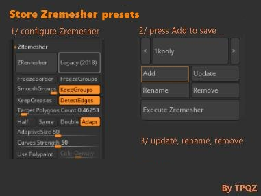

### Zremesh preset

Zremesh preset plugin with dropdown menu

Dist folder contains the original version and Zipped version of the plugin.

To modify, edit ZRemeshPresets.txt and compile it using Zbrush and put it in Zplug64 (use dist folder as reference):

Files and folders to put in plugs64 :
- ZRemeshPresets.zsc
- ZremeshPresetsData 
- DLL 
